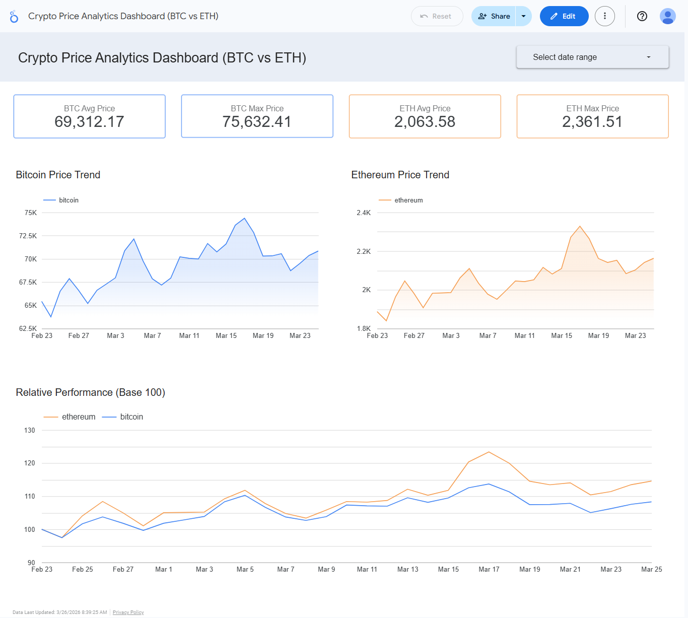

# 🚀 Crypto Data Pipeline & Analytics Dashboard

## 📌 Overview

This project demonstrates an **end-to-end data pipeline** for cryptocurrency analytics, covering data ingestion, transformation, and visualization.

The pipeline collects historical price data for **Bitcoin and Ethereum**, processes it using modern data stack tools, and presents insights through an interactive dashboard.

---

## 🧱 Tech Stack

* **Python** → Data ingestion from API
* **BigQuery** → Data warehouse
* **dbt (Data Build Tool)** → Data transformation & modeling
* **Looker Studio** → Data visualization

---

## 🔄 Data Pipeline Architecture

```
API (CoinGecko)
    ↓
Python (Ingestion)
    ↓
BigQuery (Raw Table)
    ↓
dbt (Staging & Mart Models)
    ↓
Looker Studio (Dashboard)
```

---

## 🗂️ Project Structure

crypto-api-data-pipeline-dbt-and-bigquery/
│
├── ingestion/
│   └── main.py          # Extract & load to BigQuery
│
├── dbt/
│   ├── models/
│   │   ├── staging/     # stg_crypto.sql
│   │   └── mart/        # crypto_summary.sql
│   │                    # crypto_indexed.sql (Base 100)
│   └── profiles.yml
│
├── screenshots/         # Dashboard previews
├── requirements.txt
└── README.md
```

---

## Setelah Update

Commit message yang bisa kamu pakai:
```
docs: improve README with project structure, insights, and contact info

---
## 📊 Data Models

### 🔹 Staging Layer

* `stg_crypto.sql`
* Cleans and standardizes raw data

### 🔹 Mart Layer

* `crypto_summary.sql`
* Aggregates daily metrics:

  * Average price
  * Max price
  * Min price

### 🔹 Analytics Layer

* `crypto_indexed.sql`
* Normalizes price to **Base 100** for fair comparison

---

## 📈 Dashboard Features

* KPI Metrics (BTC & ETH)
* Price Trend Visualization
* Comparative Analysis using Indexed Performance (Base 100)

---

## 📸 Dashboard Preview



---

## ⚙️ How to Run

### Prerequisites
- Python 3.8+
- Google Cloud account with BigQuery enabled
- Service account key (JSON) with BigQuery permissions
- dbt installed (`pip install dbt-bigquery`)

### Setup
1. Clone this repository
2. Copy your GCP service account key to the project root
3. Configure `dbt/profiles.yml` with your BigQuery project ID

### 1. Install dependencies
pip install -r requirements.txt

### 2. Run ingestion script
python ingestion/main.py

### 3. Run dbt models
dbt run

### 4. Verify in BigQuery
Check your BigQuery console — you should see:
- Raw table: `raw.crypto_prices`
- Staging: `staging.stg_crypto`
- Mart: `mart.crypto_summary`
- Analytics: `mart.crypto_indexed`
---

## 💡 Key Insights

- Ethereum outperformed Bitcoin in relative terms during the observed 
  period, gaining ~15% vs Bitcoin's ~10% when measured from the same 
  base index (Base 100)
- Indexed price normalization reveals performance gaps that are 
  completely invisible when comparing absolute prices — BTC at $69K 
  vs ETH at $2K looks incomparable, but Base 100 tells the real story
- Live API ingestion via CoinGecko enables continuous time-series 
  accumulation, making the dataset more valuable the longer the 
  pipeline runs
---

## 🎯 What I Learned

* Building end-to-end data pipelines
* Data modeling using dbt (staging & mart layers)
* Handling data granularity and aggregation
* Designing business-friendly dashboards

---

## 📬 Contact

Let's connect! I'm actively looking for Data Engineer opportunities.

🔗 LinkedIn : linkedin.com/in/antonius-tanianto
📧 Email    : antoniustanianto@gmail.com
